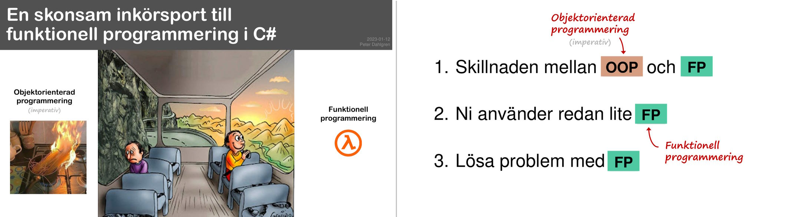

# Funktionell programmering i C#

*En skonsam inkörsport till funktionell programmering i C#*

Presentation om hur man kan förvandla objektorienterad programmering till att bli mer funktionell programmering i C#.

Innehåll:

1. Skillnaden mellan OOP och FP
2. Ni använder redan lite FP
3. Lösa problem med FP

